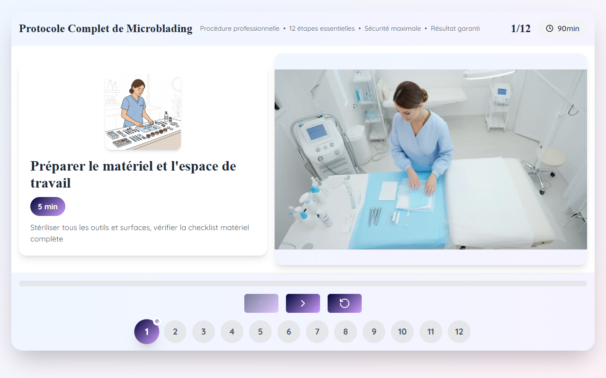

# Guide Interactif Microneedling — Microblading & Microblading EN Slide 13

**Course:** MICROBLADING & MICROBLADING (EN)  
**Slide:** 13  
**Live URL:** https://v0-microneedlinginteractive3.edtechiecorp.com  
**Stack:** Next.js · Tailwind CSS · TypeScript · GitHub Pages  

## What this slide does

An interactive microneedling protocol guide embedded within the microblading course — covering the use of microneedling as a complementary or preparatory technique alongside microblading. Learners step through the protocol interactively, understanding when and how to incorporate microneedling into a combined treatment session. The interactive format makes it easier to memorise the sequence of steps compared to static text.

## Screenshot

## Usage

This slide is embedded as an iframe inside Coassemble at the live URL above. DNS is managed via Cloudflare (`edtechiecorp.com`). To update the slide, push to the `main` branch — GitHub Actions will rebuild and redeploy automatically.
